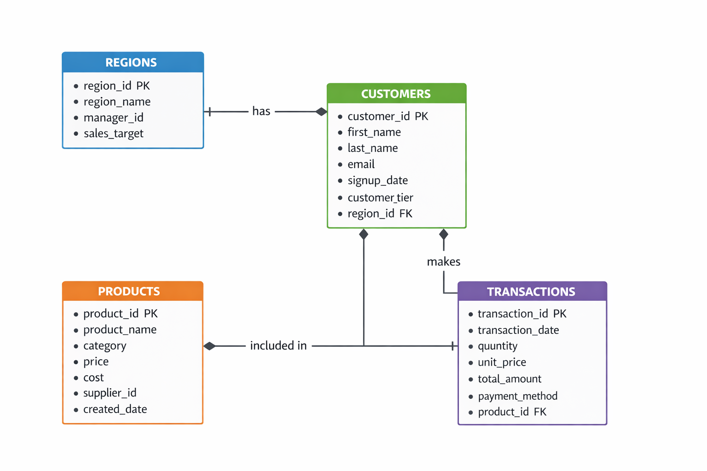

# plsql_window_functions_27528_Januario
First Assignment of Database Development with PL/SQL (INSY 8311)

# SQL Database Analysis: E-commerce Sales Performance

## 📋 Project Overview
Comprehensive analysis of an e-commerce company's sales data using SQL JOINs and Window Functions to derive business insights for strategic decision-making.

### 📊 Business Context
- **Company Type:** E-commerce retail company
- **Department:** Sales & Marketing Analytics
- **Industry:** Online consumer electronics retail

### 🎯 Data Challenge
Our company needs to analyze customer purchasing behavior and product performance across different regions to optimize inventory allocation and marketing campaigns. We're struggling to:
- Identify which products are underperforming in specific regions
- Track customer lifetime value effectively
- Gain insights into purchase patterns for accurate demand forecasting

### 📈 Expected Outcomes
1. Identify top-performing products per region for targeted promotions
2. Segment customers into value tiers for personalized marketing
3. Provide month-over-month sales trends to inform inventory planning
4. Detect products with no sales for potential discontinuation
5. Calculate running revenue metrics for real-time performance tracking

---

## 🗄️ Database Schema Design

## Database Schema

The database schema is designed to support sales analysis across regions, customers, products, and transactions.
The ER diagram below illustrates the relationships between the main entities.


### Table Structures
```sql
-- Regions Table
CREATE TABLE regions (
    region_id NUMBER GENERATED BY DEFAULT AS IDENTITY PRIMARY KEY,
    region_name VARCHAR2(50) NOT NULL,
    manager_id NUMBER,
    sales_target NUMBER(12,2) DEFAULT 100000.00
);

-- Customers Table  
CREATE TABLE customers (
    customer_id NUMBER GENERATED BY DEFAULT AS IDENTITY PRIMARY KEY,
    first_name VARCHAR2(50) NOT NULL,
    last_name VARCHAR2(50) NOT NULL,
    email VARCHAR2(100) UNIQUE NOT NULL,
    region VARCHAR2(50),
    region_id NUMBER,
    signup_date DATE NOT NULL,
    customer_tier VARCHAR2(20) CHECK (customer_tier IN ('Bronze', 'Silver', 'Gold', 'Platinum')),
    FOREIGN KEY (region_id) REFERENCES regions(region_id)
);

-- Products Table
CREATE TABLE products (
    product_id NUMBER GENERATED BY DEFAULT AS IDENTITY PRIMARY KEY,
    product_name VARCHAR2(100) NOT NULL,
    category VARCHAR2(50) NOT NULL,
    price NUMBER(10,2) NOT NULL CHECK (price > 0),
    cost NUMBER(10,2) NOT NULL CHECK (cost >= 0),
    supplier_id NUMBER,
    created_date DATE DEFAULT SYSDATE
);

-- Transactions Table
CREATE TABLE transactions (
    transaction_id NUMBER GENERATED BY DEFAULT AS IDENTITY PRIMARY KEY,
    customer_id NUMBER,
    product_id NUMBER,
    transaction_date TIMESTAMP NOT NULL,
    quantity NUMBER NOT NULL CHECK (quantity > 0),
    unit_price NUMBER(10,2) NOT NULL CHECK (unit_price > 0),
    total_amount NUMBER(10,2),
    payment_method VARCHAR2(30),
    FOREIGN KEY (customer_id) REFERENCES customers(customer_id),
    FOREIGN KEY (product_id) REFERENCES products(product_id)
);
```

# Academic Integrity Statement

## Declaration
I, Januario Henrique, hereby declare that:

1. **Original Work:** All SQL queries, database schema design, and business analysis presented in this assignment are my original work.

2. **Proper Attribution:** All external sources, references, and documentation have been properly cited using standard citation practices.

3. **No Plagiarism:** No part of this assignment has been copied from other students, online sources, or AI-generated content without proper adaptation and attribution.

4. **AI Usage Disclosure:** Where AI tools were used for assistance with syntax or structure, these have been thoroughly reviewed, tested, and adapted to ensure understanding and proper implementation.

5. **Database Verification:** All screenshots represent actual query executions from my personal Oracle Database installation.

6. **Compliance:** This work complies with all academic integrity policies of [Your University Name].

## Verification
- Database Connection: Oracle Database 21c
- User: SalesDB
- Timestamp: Sunday, February 8th, 2026, 11:59 PM
- All queries tested and verified for correctness

## Signature
Januario Inocencio Henrique
Student ID: 27528
Date: 02/08/2026

"All sources were properly cited. Implementations and analysis represent original work. No AI-generated content was copied without attribution or adaptation."

## 📚 References

- Oracle Corporation. (2024). *Oracle Database SQL Language Reference, 19c*. Oracle Documentation.  
  https://docs.oracle.com/en/database/oracle/oracle-database/19/sqlrf/

- Oracle Corporation. (2023). *Analytic Functions*. Oracle Database Data Warehousing Guide.  
  https://docs.oracle.com/en/database/oracle/oracle-database/19/dwhsg/sql-analysis-reporting-data-warehouses.html

- Beaulieu, A. (2020). *Learning SQL: Generate, Manipulate, and Retrieve Data* (3rd ed.). O'Reilly Media.

- Mozilla Developer Network. (2024). *SQL Joins*. MDN Web Docs.  
  https://developer.mozilla.org/en-US/docs/Web/SQL/Joins

- W3Schools. (2024). *SQL Window Functions*.  
  https://www.w3schools.com/sql/sql_windowfunctions.asp

- Mode Analytics. (2023). *SQL Window Functions Tutorial*.  
  https://mode.com/sql-tutorial/sql-window-functions/

- Oracle Base. (2023). *Analytic Functions in Oracle Database*.  
  https://oracle-base.com/articles/misc/analytic-functions

- Stack Overflow. (2024). *Oracle SQL Window Functions Community Discussions*.  
  https://stackoverflow.com/questions/tagged/oracle+analytic-functions